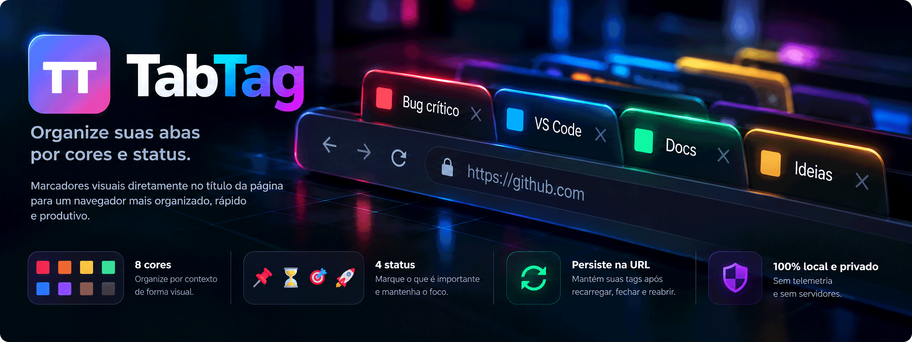

<div align="center">

<p align="center">
  
</p>

**Marcadores visuais para organizar abas em navegadores baseados em Chromium, com persistência por URL ou domínio e armazenamento local.**

<p align="center">
  <a href="https://developer.chrome.com/docs/extensions/mv3/intro/">
    
  </a>
  <a href="https://developer.mozilla.org/en-US/docs/Web/JavaScript">
    
  </a>
  <a href="#privacidade-e-permissões">
    
  </a>
  <a href="LICENSE">
    
  </a>
</p>

</div>

## O que é o TabTag

O TabTag adiciona marcadores visuais diretamente ao título das páginas para facilitar a identificação de abas abertas.

Você escolhe uma cor ou um status pelo popup da extensão:

```text
🟥 Bug crítico | Frontend
🟦 GitHub | TabTag
🟩 Documentação | Projeto
📌 Notion | Especificação
⏳ Deploy | Produção
🎯 Roadmap | Sprint atual
```

O marcador pode ficar associado à URL atual ou ao domínio inteiro.

Com o modo por URL, cada endereço mantém seu próprio marcador. Com **Aplicar a todo o domínio** ativado, páginas do mesmo domínio compartilham a mesma tag.

Exemplo:

```text
www.linkedin.com/feed/                 🟦
www.linkedin.com/in/vitor-vilas-boas/ 🟦
www.linkedin.com/jobs/                 🟦
```

A persistência fica no próprio navegador e atravessa recarregamentos, fechamento de abas e novas sessões.

## Compatibilidade

O TabTag foi desenvolvido para navegadores baseados em Chromium.

O projeto tem como alvo:

- Google Chrome
- Microsoft Edge
- Chromium

Outros navegadores baseados em Chromium, como Brave, Vivaldi e Opera, também podem funcionar com o TabTag, mas ainda não fazem parte da matriz de testes do projeto.

## Como funciona

Ao selecionar uma tag, o TabTag salva o marcador em `chrome.storage.local`.

O escopo depende da chave seletora do popup. A escolha também fica salva em `chrome.storage.local`, então o estado da chave é mantido ao navegar entre páginas do mesmo domínio.

### Por URL

Com **Aplicar a todo o domínio** desligado:

```text
https://www.linkedin.com/feed/ → 🟦
```

A tag vale somente para essa URL.

### Por domínio

Com **Aplicar a todo o domínio** ligado:

```text
www.linkedin.com → 🟦
```

A tag passa a valer para as páginas desse domínio.

O domínio usado pelo TabTag é o `hostname` exato. Por isso, por exemplo, `www.exemplo.com` e `app.exemplo.com` são tratados separadamente.

## Escopo por URL ou domínio

Os dois modos são exclusivos.

Quando **Aplicar a todo o domínio** é ativado, a mudança passa a valer imediatamente. Se a página atual já tiver um marcador, ele é promovido para o domínio e passa a ser usado nas outras URLs daquele `hostname`. O TabTag também remove marcadores específicos já armazenados para esse mesmo domínio.

Exemplo:

```text
www.linkedin.com → 🟦
```

Então páginas como estas usam a mesma tag:

```text
/feed/
/in/vitor-vilas-boas/
/jobs/
```

Ao desligar a chave, a mudança também é imediata. Se existir um marcador de domínio, ele é mantido apenas na URL atual e a regra geral do domínio é removida.

## Restauração automática

O marcador é aplicado como prefixo de `document.title`.

O TabTag acompanha carregamentos, mudanças de URL e alterações de título usando eventos nativos do navegador.

Também restaura os marcadores quando o navegador é iniciado novamente e quando abas são recuperadas de uma sessão anterior.

Se o título já contém a tag correta, nada é executado. Se a página remover o marcador, o TabTag o reaplica.

## Páginas que alteram o título depois do carregamento

Aplicações como Gemini, YouTube, WhatsApp Web, LinkedIn e Notion podem atualizar `document.title` depois que a interface já foi carregada.

O TabTag usa dois eventos do navegador para esse cenário:

- `chrome.tabs.onUpdated` para carregamentos e alterações de título;
- `chrome.webNavigation.onHistoryStateUpdated` para navegação interna feita pela History API, comum em aplicações SPA.

```text
Página altera o título ou muda de rota
               │
               ▼
 tabs.onUpdated / webNavigation
               │
               ▼
Existe marcador para a URL ou domínio?
               │
               ▼
Título já começa com ele?
               │
          ┌────┴────┐
          │         │
         sim       não
          │         │
       encerra   reaplica
```

Após uma mudança de rota pela History API, o TabTag faz uma única revalidação curta para cobrir páginas que atualizam o título logo depois da navegação. Isso é acionado pelo evento de navegação e não mantém observação contínua da página.

Não é necessário manter `MutationObserver` permanente nem polling (verificação contínua) dentro da página.

Essa é uma decisão de arquitetura do projeto. O TabTag deve continuar pequeno, orientado a eventos e sem monitoramento contínuo do DOM.

## Persistência

Enquanto existir um marcador salvo, o TabTag pode restaurá-lo quando:

- a página é recarregada;
- o site altera o próprio título;
- a navegação muda de URL dentro de uma aplicação SPA;
- a aba é fechada e aberta novamente;
- a URL é aberta em outra aba ou janela;
- outra página do domínio é aberta, quando o modo por domínio está ativo;
- o navegador é fechado e aberto novamente;
- o computador é reiniciado e a página volta a ser aberta.

Os marcadores e a escolha de escopo ficam em `chrome.storage.local`.

O `chrome.storage.session` é usado apenas para acompanhar o estado temporário das abas durante a sessão atual.

## Remoção de marcadores

O botão **Remover Marcador** respeita o escopo selecionado no popup:

- chave desligada: remove o marcador específico da URL atual;
- chave ligada: remove o marcador do domínio atual.

Emojis que façam parte do título original da página não são removidos apenas por também existirem na paleta do TabTag.

## Barra de endereços e histórico

Como o TabTag altera o título real da página, o marcador também pode aparecer em locais onde o navegador reutiliza esse título, como sugestões da barra de endereços e resultados do histórico.

Exemplo:

```text
🟪 TabTag - Google Gemini
🟦 GitHub - Projeto
🟥 Bug crítico - Aplicação
```

O comportamento exato dessas sugestões é controlado pelo próprio navegador.

## Marcadores disponíveis

### Cores

| Marcador | Uso sugerido |
| :---: | --- |
| 🟥 | Urgente / Crítico |
| 🟧 | Pendente / Atenção |
| 🟨 | Rascunho / Ideia |
| 🟩 | Concluído / Finanças |
| 🟦 | Trabalho / Código |
| 🟪 | Pessoal / Leitura |
| 🟫 | Referência / Arquivo |
| ⬛ | Foco / Concluído |

### Status e foco

| Marcador | Uso sugerido |
| :---: | --- |
| 📌 | Fixado / Importante |
| ⏳ | Aguardando / Em andamento |
| 🎯 | Foco / Prioridade |
| 🚀 | Ação / Em produção |

Os significados são uma convenção visual. Para o TabTag, todos funcionam como marcadores de título.

## URLs suportadas

O TabTag atua em páginas HTTP e HTTPS:

```text
http://
https://
```

Páginas internas do navegador, como:

```text
chrome://extensions
chrome://settings
edge://extensions
```

não recebem marcadores.

## Arquitetura

O projeto usa Manifest V3 e JavaScript puro.

Não há framework de frontend, backend, banco de dados remoto ou etapa de build.

```text
tabtag/
├── assets/
├── docs/
├── icons/
├── .gitignore
├── background.js
├── CHANGELOG.md
├── LICENSE
├── manifest.json
├── popup.html
├── popup.js
└── README.md
```

### `popup.html`

Contém a interface da extensão, com oito cores, quatro marcadores de status, a chave para alternar entre URL e domínio e o botão de remoção.

### `popup.js`

Cuida da interação com o popup:

- identifica a aba ativa;
- escolhe a chave de armazenamento por URL ou domínio;
- aplica, troca e remove marcadores;
- aplica o escopo escolhido e evita conflito entre regras por URL e por domínio;
- atualiza o estado temporário da aba.

### `background.js`

É o Service Worker (trabalhador de serviço) responsável pela restauração dos marcadores.

Ele acompanha:

- carregamentos, mudanças de URL e alterações de título com `chrome.tabs.onUpdated`;
- mudanças de rota pela History API com `chrome.webNavigation.onHistoryStateUpdated`;
- novas abas com `chrome.tabs.onCreated`;
- inicialização do navegador com `chrome.runtime.onStartup`;
- instalação ou atualização da extensão com `chrome.runtime.onInstalled`.

Na resolução do marcador, uma regra de domínio tem prioridade e vale para todas as URLs daquele `hostname`. Se não existir regra de domínio, o TabTag procura um marcador para a URL exata.

### Armazenamento

Marcadores específicos continuam usando a URL completa como chave, mantendo compatibilidade com versões anteriores do TabTag.

Marcadores de domínio usam chaves internas no formato:

```text
tabtag:domain:www.exemplo.com
```

## Princípios do projeto

O TabTag nasceu para ser simples e deve continuar assim.

A extensão usa APIs nativas do navegador e evita manter lógica executando continuamente dentro das páginas.

- usar eventos nativos do navegador;
- evitar observação contínua do DOM;
- manter armazenamento e funcionamento locais;
- evitar dependências sem necessidade;
- usar o menor conjunto possível de permissões;
- preservar uma base de código pequena e fácil de entender.

O TabTag não pretende se tornar um gerenciador completo de abas.

Funcionalidades que exijam observação permanente do DOM, acompanhamento de componentes internos dos sites ou infraestrutura desproporcional ao objetivo da extensão ficam fora do escopo do projeto.

## Instalação

O TabTag ainda não é distribuído pela Chrome Web Store.

A forma mais simples de instalar é baixar o ZIP publicado em **Releases**, descompactar e carregar a pasta como extensão local.

### Baixando a versão pronta

1. Abra a página **Releases** deste repositório.
2. Entre na versão mais recente.
3. Em **Assets**, baixe:

```text
tabtag-v1.2.3.zip
```

4. Descompacte o arquivo em uma pasta permanente no computador.

> Não carregue o arquivo `.zip` diretamente. O navegador precisa da pasta já descompactada.

### Google Chrome e Chromium

Abra:

```text
chrome://extensions
```

Ative **Modo do desenvolvedor** e clique em **Carregar sem compactação**.

Selecione a pasta que contém `manifest.json`.

### Microsoft Edge

Abra:

```text
edge://extensions
```

Ative **Modo do desenvolvedor** e clique em **Carregar descompactado**.

Selecione a pasta que contém `manifest.json`.

### Instalando pelo código-fonte

```bash
git clone https://github.com/vitorvilas/tabtag.git
cd tabtag
```

Depois carregue a própria pasta clonada como extensão descompactada.

Arquivos como `README.md`, `CHANGELOG.md`, `LICENSE` e o conteúdo de `docs/` não interferem no funcionamento da extensão.

## Atualização manual

Enquanto o TabTag for distribuído por ZIP, atualizações também são feitas manualmente.

1. baixe a nova versão em **Releases**;
2. substitua a pasta local pela nova versão;
3. abra a página de extensões;
4. clique em **Recarregar** no TabTag.

Os marcadores salvos em `chrome.storage.local` pertencem à instalação da extensão e não aos arquivos da pasta do projeto.

## Privacidade e permissões

Os marcadores ficam armazenados localmente pelo navegador.

O TabTag não possui backend para armazenar tags e não implementa telemetria.

A interface também não depende de bibliotecas ou scripts externos.

| Permissão | Uso |
| --- | --- |
| `scripting` | Executa o código que altera `document.title` |
| `storage` | Armazena os marcadores e o estado temporário da sessão |
| `http://*/*` | Permite restaurar tags em páginas HTTP |
| `https://*/*` | Permite restaurar tags em páginas HTTPS |

## Limites atuais

No modo por URL, qualquer mudança que produza um endereço diferente pode gerar outra entrada.

No modo por domínio, o TabTag usa o `hostname` exato. Subdomínios são independentes:

```text
www.exemplo.com
app.exemplo.com
```

Os modos por URL e por domínio são exclusivos. Ao criar uma regra para o domínio, o TabTag remove regras específicas daquele mesmo `hostname`. Ao voltar para o modo por URL, a regra de domínio é removida.

## Histórico de versões

Consulte [`CHANGELOG.md`](CHANGELOG.md) para ver as alterações de cada versão.

## Licença

Distribuído sob a licença **MIT**. Consulte [`LICENSE`](LICENSE) para mais informações.

## Autor

Desenvolvido por **Vitor Vilas Boas**.
